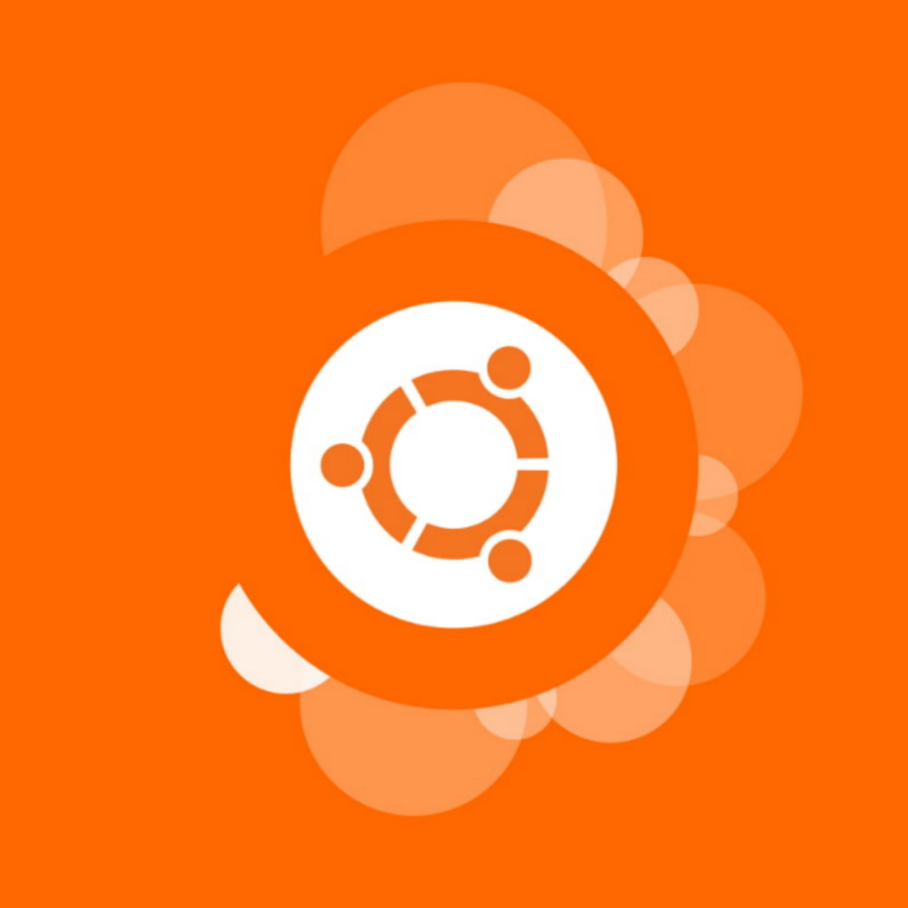

    

<h1 align="center">Astrial Music Bot</h1>

    
Repo Stats

    
    
    
      
     
    
    
     
     
    
     
     
    
     

---

     
    
Dependency Checker

    
     
     

---

     
    
Bot Votes

    
     
     

-----

    

 
 

# BOT READY FOR PRODUCTION

## Have a bug?

Submit an `Issue` and tell me what's wrong.

## Things to note before cloning

This codebase is uses discord.js, sqlite3, .env, and a few other packages. If you experience a problem with a package, don't blame me.

The bot so far only supports Prefix commands. 

Road Map:
- v0.5: 
  - Will introduce slash commands.

# How to get working:
1. Do `npm install` to install all dependencies.
2. Navigate to the root (Astrial Folder) and create a `.env` file.
3. Fill out `.env`.
4. Run Bot.
   1. Local Machine: Use `Run and Debug` menu. Do NOT just do `node bot.js`, it wont break, you'll just look dumb. The `.vscode` folder has a launch.json file which points to the file that starts the bot.
   2. Server Machine: Install pm2 (`npm install pm2 -g`) and navigate to the `cd src/` do `pm2 start shard.js --name "name of bot"`. This will auto restart the bot if a critical error occurs and allows you to remotely monitor your bot on the [PM2](https://app.pm2.io) website.
